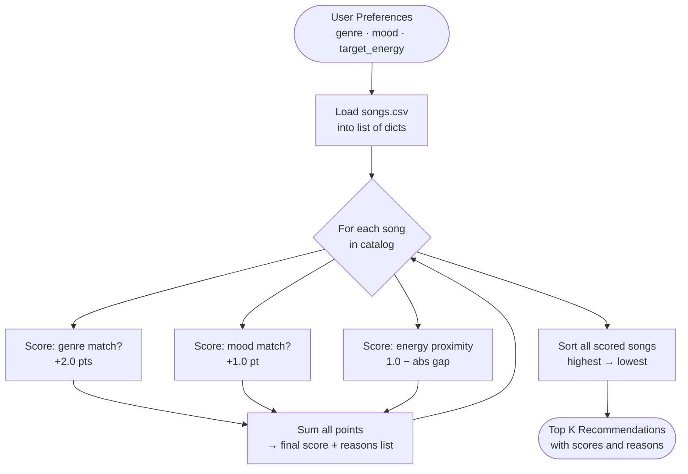

# 🎵 Music Recommender Simulation

## Project Summary

In this project you will build and explain a small music recommender system.

Your goal is to:

- Represent songs and a user "taste profile" as data
- Design a scoring rule that turns that data into recommendations
- Evaluate what your system gets right and wrong
- Reflect on how this mirrors real world AI recommenders

This version simulates a content-based music recommender. It reads a catalog of 18 songs from a CSV file, scores each one against a user's stated genre, mood, and energy preferences, and returns the top 5 matches ranked by relevance score. Every recommendation includes a plain-language explanation of why it was chosen. The project was built to explore how recommendation systems turn raw data into personalized suggestions — and where simple scoring logic can go wrong.

---

## How The System Works

Real-world recommendation systems like Spotify or YouTube use two main strategies to predict what you'll enjoy. **Collaborative filtering** looks at patterns across many users — if people with similar listening history to yours also loved a particular song, the system suggests it to you too. **Content-based filtering** ignores other users entirely and instead analyzes the properties of songs you've already liked (tempo, genre, mood) to find new tracks that share those same qualities. Most production systems blend both approaches, but collaborative filtering requires massive amounts of user behavior data that we don't have in a classroom simulation.

Our version uses **pure content-based filtering**: it compares a user's stated taste preferences directly against each song's attributes to compute a relevance score, then ranks all songs from highest to lowest score and returns the top results. This approach is transparent and explainable — every recommendation comes with a reason tied to specific features — which makes it ideal for understanding the core mechanics of how recommenders work.

**Features used by the `Song` object:**

| Feature | Type | Description |
|---|---|---|
| `genre` | string | Musical genre (e.g., pop, lofi, rock, jazz) |
| `mood` | string | Emotional tone (e.g., happy, chill, intense, moody) |
| `energy` | float (0.0–1.0) | Perceived intensity and activity level |
| `tempo_bpm` | float | Beats per minute — pace of the track |
| `valence` | float (0.0–1.0) | Musical positiveness; higher = more upbeat |
| `danceability` | float (0.0–1.0) | How suitable the track is for dancing |
| `acousticness` | float (0.0–1.0) | Confidence that the track is acoustic |

**Features used by the `UserProfile` object:**

| Preference | Type | Description |
|---|---|---|
| `favorite_genre` | string | The genre the user most wants to hear |
| `favorite_mood` | string | The mood that best matches the user's current vibe |
| `target_energy` | float (0.0–1.0) | The energy level the user is looking for |
| `likes_acoustic` | bool | Whether the user prefers acoustic over electronic sounds |

The scoring logic awards points for exact matches on genre and mood, and calculates a proximity score for numerical features like energy — so a song doesn't need to be a perfect match to appear in results, just the closest available fit.

### Algorithm Recipe

Every song in the catalog is judged by the same three rules, and the results are added together into a single relevance score:

| Rule | Points | Logic |
|---|---|---|
| Genre match | +2.0 | `song.genre == user.favorite_genre` |
| Mood match | +1.0 | `song.mood == user.favorite_mood` |
| Energy proximity | 0.0 – 1.0 | `1.0 - abs(song.energy - user.target_energy)` |

**Why these weights?** Genre is the strongest signal of taste — a country fan and a metal fan rarely want the same song regardless of energy. Mood is secondary; two songs can share a genre but feel completely different emotionally. Energy is scored continuously so that songs close to the user's target are rewarded even if they don't hit it exactly.

**Maximum possible score: 4.0** (genre match + mood match + perfect energy alignment)

### Data Flow



### Known Biases and Limitations

- **Genre dominance:** A genre match is worth twice as much as a mood match. Songs that share the user's genre will almost always outrank songs from other genres, even if those songs are a far better match in mood and energy. This can create a "genre bubble" where the user never sees great tracks outside their stated preference.
- **Catalog imbalance:** If the dataset contains more songs of one genre than others, that genre will statistically appear in top results more often — not because those songs are better, but simply because there are more of them to match against.
- **Binary matching:** Genre and mood are treated as exact string matches. A user who likes "indie pop" gets zero credit for a "pop" song and vice versa, even though those genres heavily overlap.
- **Energy-only numerical scoring:** Tempo, valence, danceability, and acousticness are all ignored by the base recipe — a high-valence, highly danceable song gets the same energy-proximity score as a slow dirge, as long as both have the same energy value.

---

## Getting Started

### Setup

1. Create a virtual environment (optional but recommended):

   ```bash
   python -m venv .venv
   source .venv/bin/activate      # Mac or Linux
   .venv\Scripts\activate         # Windows

2. Install dependencies

```bash
pip install -r requirements.txt
```

3. Run the app:

```bash
python -m src.main
```

### Running Tests

Run the starter tests with:

```bash
pytest
```

You can add more tests in `tests/test_recommender.py`.

---

## Experiments You Tried

**Weight shift — doubled energy, halved genre:**
Changed the genre match bonus from +2.0 to +1.0, and doubled the energy similarity score. The overall top-ranked song stayed the same for all four profiles, but the gap between #1 and the rest narrowed. The most notable change was in the Chill Lofi profile: "Spacewalk Thoughts" (ambient/chill, energy=0.28) jumped past "Focus Flow" (lofi/focused) because its energy was nearly a perfect match for the target of 0.3. With standard weights, the lofi genre bonus kept Focus Flow ahead despite the worse energy fit. This confirmed that the default genre weight is acting as a gate — a song with the wrong label struggles to compete no matter how well it fits the vibe.

**Adversarial profile — sad mood + high energy:**
Tested a profile with `genre=r&b, mood=sad, energy=0.9`. These preferences conflict: sad songs are almost always slow and low-energy. The system handled it by ranking "Rainy Days & Neon Signs" (r&b/sad, energy=0.48) at #1 because the genre and mood bonus outweighed the energy penalty. Slots 3–5 were filled by completely unrelated high-energy songs that scored on energy alone. The results split in two: half matched the emotional preference, half matched the intensity preference. Neither half felt complete.

**Four diverse profiles tested overall:**
High-Energy Pop, Chill Lofi, Deep Intense Rock, and the Adversarial profile above. In every case the "perfect match" song (matching all three criteria) ranked #1. The system behaved as expected for straightforward profiles, but showed clear limitations when catalog coverage was thin (only one rock song available) or preferences were contradictory.

---

## Limitations and Risks

- **Tiny catalog.** 18 songs is not enough to serve diverse tastes. A rock fan gets one genre-matched result, then filler. A lofi fan gets three.
- **Genre label as a hard gate.** "Indie pop" and "pop" are treated as completely different genres. A song can be a near-perfect match in every other way and still lose to a mediocre song that happens to share the exact genre string.
- **No learning.** The system never adapts. It gives the same results every time for the same profile regardless of what the user actually plays, skips, or repeats.
- **Ignored features.** Valence, danceability, acousticness, and tempo are stored in the CSV but never used in scoring.
- **No diversity controls.** The top 5 can easily be dominated by songs from a single artist or genre if the catalog is imbalanced.

See [`model_card.md`](model_card.md) for the full limitations and bias analysis.

---

## Reflection

[**Full Model Card →**](model_card.md)

The biggest learning moment in this project was realizing how much a single design decision — the genre weight being 2.0 instead of 1.0 — shapes every result the system produces. It feels like a small number, but it means genre is twice as powerful as mood in every scoring calculation. That's a value judgment baked into the math, and the system never tells the user it's there. Real recommendation engines have hundreds of weights like this, tuned through experimentation and sometimes reinforcing biases nobody intended.

What surprised me most was how convincing the results felt even with such simple logic. When the High-Energy Pop profile returned "Sunrise City" at #1 with a score of 3.92, it genuinely seemed like a smart recommendation. But there was no understanding behind it — the system doesn't know what pop music sounds like. It just pattern-matched three labels and added up some numbers. That gap between "feels right" and "actually understands" is probably the most important thing I'll carry forward when thinking about real AI systems.


